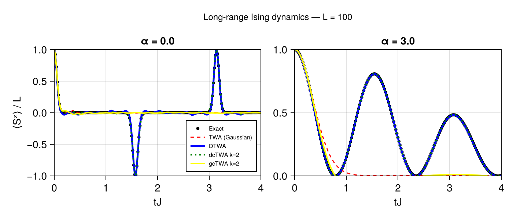

# Long-range Ising Benchmark

This example compares four truncated-Wigner descriptions of a
long-range Ising chain against an analytical result:

- traditional Gaussian TWA,
- discrete TWA (DTWA),
- Gaussian cluster TWA (gcTWA),
- discrete cluster TWA (dcTWA).

The example illustrates an important feature of the `TWA.jl` API:
**cluster size and phase-space sampling can be varied independently while
the physical model and initial state remain unchanged.**

## Model

Consider a one-dimensional chain of ``N`` spin-``1/2`` degrees of
freedom with the Hamiltonian

```math
H =
\sum_{i<j}
J_{ij}\,
\sigma_i^x\sigma_j^x,
```

where the interactions decay as

```math
J_{ij}
=
\frac{J}{r_{ij}^{\alpha}}.
```

Here ``r_{ij}`` is the distance between sites ``i`` and ``j``.

In `TWA.jl`, the model is constructed as

```julia
using TWA

const L = 100
const J = 1.0

model = SpinModel(
    Chain(L),
    PowerLaw(
        Ising(:x; J=J);
        α=3.0,
    ),
)
```

We consider two interaction exponents:

```math
\alpha=0
```

for distance-independent all-to-all interactions, and

```math
\alpha=3
```

for a dipolar power-law decay in one dimension.

## Initial state

All spins are initially polarized along ``+z``:

```math
|\psi_0\rangle
=
|\uparrow_z\rangle^{\otimes N}.
```

In the package this is simply

```julia
state = Up()
```

The observable of interest is the longitudinal magnetization density,

```math
m_z(t)
=
\frac{1}{N}
\sum_i
\langle\sigma_i^z(t)\rangle
=
\frac{\langle S^z(t)\rangle}{N}.
```

## Exact solution

This model provides a useful benchmark because all terms in the
Hamiltonian commute:

```math
[
\sigma_i^x\sigma_j^x,
\sigma_k^x\sigma_l^x
]
=
0.
```

For the fully ``z``-polarized initial state, the local magnetization is

```math
\langle\sigma_i^z(t)\rangle
=
\prod_{j\neq i}
\cos\left(2J_{ij}t\right).
```

The exact magnetization density is therefore

```math
m_z(t)
=
\frac{1}{N}
\sum_i
\prod_{j\neq i}
\cos\left(2J_{ij}t\right).
```

This expression lets us compare the different phase-space
approximations directly against the exact dynamics without performing
exact many-body time evolution.

A simple implementation is

```julia
function exact_magnetization_z(model::SpinModel, ts)
    nsites = geometry(model).nsites
    values = zeros(Float64, length(ts))

    for (time_index, t) in pairs(ts)
        total = 0.0

        for i in 1:nsites
            local_magnetization = 1.0

            for j in 1:nsites
                i == j && continue

                Jx, _, _ = coupling_components(
                    model,
                    i,
                    j,
                )

                local_magnetization *=
                    cos(2 * Jx * t)
            end

            total += local_magnetization
        end

        values[time_index] = total / nsites
    end

    return values
end
```

!!! note
    The analytical solution can be evaluated on a much finer time grid
    than the numerical simulations. This improves the appearance of the
    exact curve without increasing the number of saved ODE time points.

For example,

```julia
simulation_times =
    collect(0.0:0.05:4.0)

exact_times =
    collect(0.0:0.01:4.0)
```

can be used independently.

## Four phase-space approximations

The benchmark separates two approximation choices:

1. whether the phase space describes individual spins or clusters;
2. whether the initial state is sampled using a Gaussian or discrete
   representation.

This gives the following comparison:

| Sampling | Single-spin | Two-spin cluster |
|---|---|---|
| Gaussian | TWA | gcTWA |
| Discrete | DTWA | dcTWA |

### Traditional TWA

For a single-spin phase space with Gaussian initial sampling, we use

```julia
twa = CTWA(
    cluster_size=1,
    trajectories=1000,
    sampling=GaussianSampling(),
)
```

At cluster size one, CTWA contains only the three single-spin
coordinates ``X``, ``Y``, and ``Z``. Its equations therefore reduce to
the ordinary classical-spin equations.

### DTWA

Discrete single-spin sampling is selected directly with

```julia
dtwa = DTWA(
    trajectories=1000,
)
```

The classical dynamics are closely related to the single-spin Gaussian
case, but the initial quantum fluctuations are represented using the
discrete spin phase space.

### Gaussian CTWA

To introduce two-spin clusters while retaining Gaussian initial
sampling, use

```julia
gctwa = CTWA(
    cluster_size=2,
    trajectories=1000,
    sampling=GaussianSampling(),
)
```

A two-spin cluster has

```math
4^2-1=15
```

nontrivial Pauli-string phase-space coordinates.

### Discrete CTWA

The corresponding discrete cluster calculation is

```julia
dctwa = CTWA(
    cluster_size=2,
    trajectories=1000,
    sampling=DiscreteSampling(),
)
```

The cluster dynamics are the same as in gcTWA. Only the representation
of the initial quantum state has changed.

## Running the simulations

A typical simulation uses

```julia
const TMAX = 4.0
const DT = 0.05
const NTRAJ = 1000

const OUTPUT_TIMES =
    collect(0.0:DT:TMAX)
```

For example, DTWA is run as

```julia
dtwa_result = simulate(
    model,
    state,
    DTWA(
        trajectories=NTRAJ,
    );
    tspan=(0.0, TMAX),
    saveat=OUTPUT_TIMES,
)
```

and the magnetization is extracted with

```julia
dtwa_mz = expectation(
    dtwa_result,
    Magnetization(:z),
)
```

The dcTWA calculation changes only the approximation:

```julia
dctwa_result = simulate(
    model,
    state,
    CTWA(
        cluster_size=2,
        trajectories=NTRAJ,
        sampling=DiscreteSampling(),
    );
    tspan=(0.0, TMAX),
    saveat=OUTPUT_TIMES,
)
```

followed by the same observable call:

```julia
dctwa_mz = expectation(
    dctwa_result,
    Magnetization(:z),
)
```

This is one of the main advantages of separating models, states,
methods, and observables in the package API.

## Results

The figure below compares the four phase-space approximations with the
analytical result for ``N=100``.

The left panel shows the all-to-all case ``\alpha=0``, while the right
panel shows the power-law case ``\alpha=3``.



The comparison should be read in two complementary ways.

At fixed single-spin phase space,

```text
TWA  ↔  DTWA
```

compares Gaussian and discrete sampling.

At fixed two-spin cluster size,

```text
gcTWA  ↔  dcTWA
```

compares the same two sampling strategies in cluster phase space.

Conversely,

```text
TWA    ↔  gcTWA
DTWA   ↔  dcTWA
```

compare single-spin and cluster descriptions while keeping the sampling
family fixed.

This makes the benchmark useful for separating the effect of the
initial phase-space representation from the effect of clustering.

## Reproducibility

Because TWA, DTWA, gcTWA, and dcTWA are Monte Carlo methods, finite
trajectory ensembles produce statistical fluctuations.

For reproducible comparisons, an explicit random-number generator can
be supplied:

```julia
using Random

result = simulate(
    model,
    state,
    DTWA(
        trajectories=1000,
    );
    tspan=(0.0, 4.0),
    saveat=0.05,
    rng=Xoshiro(1234),
)
```

Using a fixed seed is useful for examples, tests, and benchmarks.

For scientific calculations, convergence should still be checked by
increasing the number of trajectories.

## What should be converged?

There are two distinct convergence questions.

For every stochastic TWA calculation, increase the number of
trajectories:

```text
100 → 1000 → 10000
```

to assess Monte Carlo sampling noise.

For CTWA, the cluster size provides an additional approximation
parameter:

```text
k = 1 → 2 → 4 → ...
```

when compatible with the system size and computational resources.

The number of CTWA phase-space coordinates per cluster grows as

```math
4^k-1,
```

so increasing the cluster size rapidly becomes more expensive.

Trajectory convergence and cluster-size convergence should therefore be
examined separately.

## Complete example

The complete script used to generate the figure is available in the
repository as

```text
examples/ising_twa_dtwa_dctwa_comparison.jl
```

It can be run from the package root with

```bash
julia --project=docs \
    examples/ising_twa_dtwa_dctwa_comparison.jl
```

The generated figure is written to

```text
docs/src/assets/ising_twa_dtwa_dctwa_comparison.png
```

## Related methods

For details of the underlying approximations, see

- [Discrete Truncated-Wigner Approximation](../manual/dtwa.md)
- [Cluster Truncated-Wigner Approximation](../manual/ctwa.md)
- [Observables](../manual/observables.md)

The methodological literature is collected in
[References and Citation](../references.md).