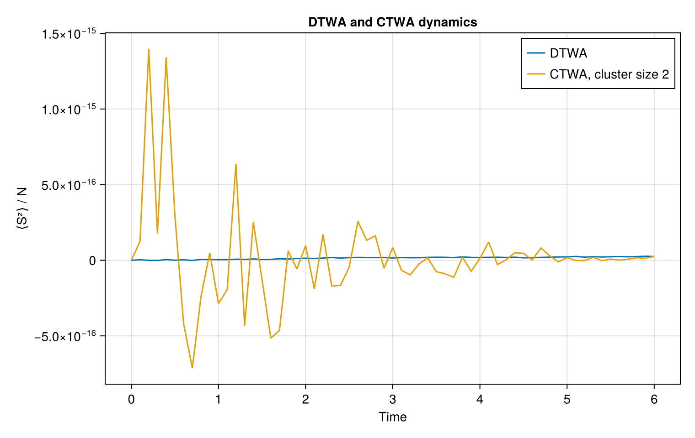

# TWA.jl

`TWA.jl` provides a unified interface for truncated-Wigner approximations
for interacting spin systems.

The package separates four concepts:

```julia
model = SpinModel(
    Chain(50),
    XXZ(J=1.0, Δ=0.5),
)

state = DomainWall()

method = DTWA(
    trajectories=1000,
)

result = simulate(
    model,
    state,
    method;
    tspan=(0, 12),
) 
```
The same model and state can be simulated using different approximations,
including DTWA and CTWA.  


## DTWA and CTWA

The same model and initial state can be evolved using different
truncated-Wigner approximations.

